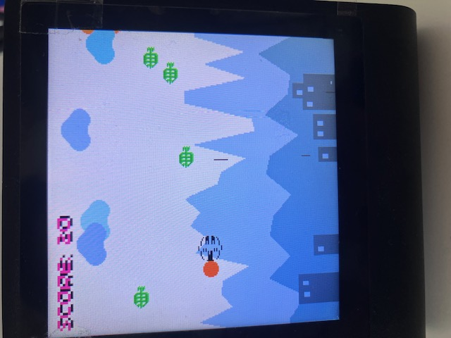
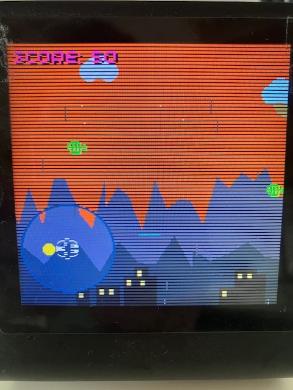

# Presto Bézier Swarm: Modular Engine (Dan Dare)

A high-performance, object-oriented 2D space shooter engine for the **Pimoroni Presto (RP2350)**. This project demonstrates advanced MicroPython techniques including Inline Assembly, Viper emitters, and a dual-layer hardware-composed rendering system.

| Daytime gameplay | Sunset transition with night dimmer |
|:---:|:---:|
|  |  |

## 🧬 v2 — Adaptive Enemies, Fractal Fire & Defection (2026-04-11)

Three new gameplay systems were added in this release:

*   **Genetic Algorithm (Enemy Evolution):** Every alien now carries a 6-gene genome (`speed`, `move_speed`, `hp`, `fire_rate_mul`, `proj_speed`, `spread_scale`). On death, its fitness score (`survival_frames + direct_hits×100`) is recorded in an 8-slot gene pool. 60% of new spawns are bred via single-point crossover and per-gene mutation — enemies literally evolve to be harder over time.
*   **Fractal Bullet Spreads:** All bullet patterns now use a golden-ratio (φ=0.618) self-similar angle tree, pre-computed at module load. The player's hero spread fires 7 projectiles, the standard spread fires 3-way, and enemy return fire also uses a 3-way fractal fan — all rotation-matrix aligned to the actual target direction.
*   **Enemy Defection (Ally System):** Non-boss aliens have a 0.02%/frame chance to switch sides. A defected alien turns cyan, homes toward the nearest enemy, fires a 3-way fractal spread at it, and body-rams enemies for bonus score. Up to 6 allies can be active at once.

---

## 🌟 Game Features & Mechanics

*   **Dynamic Threat Scaling:** The game starts with a baseline difficulty, but passing 300 points triggers a progressive spawn rate scaler. Surviving past 900 points unleashes an absolute bullet hell (~30% chance for an alien ship every frame).
*   **Desperation Mode ("Last Stand"):** Taking a hit drops your score by 50 points (150 during boss fights!). If your score crashes to 50 or below, the ship's systems automatically overdrive into Panic Mode—fire rate quadruples, and projectiles enter a wide-angle spread.
*   **Smart Seeker Aliens:** While standard Aliens navigate pre-computed quadratic Bézier curves, roughly 15% are "Seekers" that use live vector math to track your ship's visual coordinates.
*   **"Horde Mode" (Massive Shootout):** If the screen becomes swarmed with more than **10 active aliens**, the ship's firing computer automatically enters **Overdrive**. This enables the devastating 7-way massive firepower spread and ultra-fast firing cycles typically reserved for boss fights, allowing you to blast through overwhelming clusters of enemies.
*   **Environment & Village Defense:** Protect the procedural village at the bottom. Alien ships and acidic rain damage houses. If the village is in trouble (< 6 houses), the ship's priority shifts to cloud suppression.
*   **Safe Restart Engine:** Falling to 0 points triggers a Game Over UI. Upon restart, the engine performs a complete pool wipe—clearing all aliens, lasers, and rain—to ensure a clean start with a **+550 point** mission bonus.

## 🚀 Advanced Combat & Smart Systems

*   **Proactive Target Selection & Angular Aiming:**
    *   **Nearest-Enemy Tracking:** The ship's computer continuously identifies the closest threat and calculates a precise trajectory.
    *   **Angular Ballistics:** Dan's ship can now fire at angles within a **-60 to 60 degree arc**, allowing for surgical strikes against enemies above or below the horizontal plane.
*   **Automated Night-time Halo Defense:**
    *   During the night, a high-intensity spotlight (halo) follows the ship. If an alien enters the **42-pixel radius** of this halo, the ship detects the intrusion and automatically triggers its weapons systems for immediate retaliation.
*   **Tactical "Cloud Eraser" Mode:**
    *   When the village is under siege, the ship rotates 90° to fire upwards.
    *   **Golden-Yellow Lasers:** Upward-firing lasers are now distinctively colored to separate cloud-clearing missions from alien combat.
    *   **Massive Spread:** Fires a 3-way spread normally, or a 7-way "Cloud Eraser" fan during boss fights.

## 👿 Elite Enemies & Boss Environs

*   **Elite Alien Variants:** 15% of standard spawns are "Elites"—drawn in red with **2 HP**. They require multiple hits to destroy but yield **double points (+20)**.
*   **Boss Fight: Contracting Circle (Center-Screen Showdown):**
    *   **Surge to Center:** Upon triggering (every 200 points), the ship immediately surges to the center-screen (x=160) to engage the swarm.
    *   **Encirclement Formation:** 16 boss aliens spawn in a perfect ring encircling the player. They use **Professional Vector Homing** to contract the circle inward simultaneously.
    *   **Weapon Overdrive:** During these encounters, the ship gains **+500 points** and its horizontal weapons enter Overdrive, discharging a massive **7-way spread** with ultra-fast firing cycles.

## 🎨 Special Effects & Physics

*   **Trajectory-Aligned Visuals:** Laser drawing is now synchronized with velocity vectors. Projectiles draw a "tail" pointing opposite to their flight path, making angled shots look sharp and accurate.
*   **Parallax Scrolling Cityscape:** Multi-layer mountainous backdrop with randomized procedural houses. The foreground scrolling runs twice as fast as the background for depth.
*   **Dynamic Time of Day:** Real-time interpolation between Daytime, Sunset, and Midnight.
*   **Searchlight & Night Mask:** Using a Viper-based scanline renderer to dim the world while maintaining a bright protective halo around the ship.

## 🚀 Performance Optimizations

### 1. Hardware Acceleration (`utils.py`)
To maintain high FPS on the RP2350, critical path routines use specialized emitters:
*   **`asm_lerp_unit`**: Uses **ARM Thumb-2 Inline Assembly** for color transitions.
*   **`get_bezier_point`**: A **Viper-optimized** quadratic Bézier solver using fixed-point math.
*   **`fast_dimmer`**: A Viper-based scanline renderer for lighting masks.

### 2. Dual-Layer Compositing
*   **Layer 0**: Static/Slow-moving background elements (Sky, Sun/Moon, Parallax Mountains, Clouds).
*   **Layer 1**: High-frequency gameplay elements (Aliens, Lasers, Particles, Ship).

### 3. Memory Safety & Stability
*   **Zero-division Guard:** Homing alien AI clamps minimum distance to prevent `NaN` propagation into `int()` draw calls—a hard freeze on MicroPython.
*   **Incremental Cloud Pen Allocation:** Respawned clouds append a single new pen slot rather than rebuilding the entire `cloud_pens` list, preventing pen-slot exhaustion across multiple weather cycles.
*   **Targeted GC Windows:** `gc.collect()` is called at two high-value moments—immediately when a boss swarm is defeated (reclaiming all 16 alien objects at once) and at the start of each game reset (before new `Environment`/`Ship` objects are allocated), minimising peak heap pressure.
*   **`__slots__` on All Entity Classes:** `Alien`, `Laser`, `EnemyLaser`, `Particle`, and `Game` all declare `__slots__`, eliminating per-instance `__dict__` overhead and ensuring strict attribute safety on MicroPython.

## 🏆 Achievements

Nine persistent achievements are tracked in `achievements.json` and survive across sessions. A gold notification banner appears for ~3 seconds on unlock. The current count is shown in the bottom-right corner of the HUD.

| Achievement | How to unlock |
|---|---|
| First Blood | Destroy your first alien |
| Cloud Buster | Destroy 10 clouds in a single game |
| Village Guardian | Reach score 1000 with all 12 houses intact |
| Boss Slayer | Defeat your first boss swarm |
| Nuke Em | Fire the nuclear weapon |
| Centurion | Reach score 1000 |
| Legendary | Reach score 2000 |
| Night Owl | Earn an hourly bonus during the night phase |
| Untouchable | Reach score 500 without any alien collision damage |

## 💡 Ambient LED System

The 7 ambient LEDs reflect game state in real-time with a 9-level priority system:

| Priority | Condition | Effect |
|---|---|---|
| 1 | Game over | Hard red flash |
| 2 | Nuke fired | White flash fading over 60 frames |
| 3 | Ship hit | Orange fade over 15 frames |
| 4 | Boss fight | Red wave sweeping across LEDs with per-LED sine flicker |
| 5 | Explosion | Brief orange burst |
| 6 | Hourly victory | Warm gold pulse |
| 7 | Night | Independent starfield twinkle per LED |
| 8 | Daytime | Score-based ambient glow — green (safe) to red (danger) with slow pulse |

## 🎮 How to Play
1. Upload all `.py` files to the root directory of your Presto.
2. Run `main.py` and launch `dandare.py`.
3. Protect the village! Use the "Nuclear" option (shoot the Sun/Moon) only when in absolute peril. High Score is saved to `highscore.txt`.

## 🤖 Future Development: Machine Learning
The repository includes a "Fly-by-wire" system designed for End-to-End Imitation Learning and Reinforcement Learning:

*   **`telemetry.py` (The Black Box)**: Captures a normalized **State Vector**, expert actions, and rewards every frame.
*   **`headless.py` & `sim.py` (The Simulator)**: A mock hardware shim and training harness that allows the game to run on a PC as an OpenAI Gym-style environment at **1000+ FPS**.
*   **`dandare-ml.py` & `utils-ml.py`**: Specialized versions for model inference and high-speed data generation.

### The ML Workflow:
1.  **Record**: Run `dandare.py` on Presto with telemetry to capture expert human/rule-based play.
2.  **Train**: Use the captured CSV on a PC to train a neural network (e.g., via Behavioral Cloning).
3.  **Simulate**: Use `sim.py` to stress-test the trained model at high speed in the headless environment.
4.  **Deploy**: Upload the model to the Presto and watch an AI-driven Dan Dare protect the village!